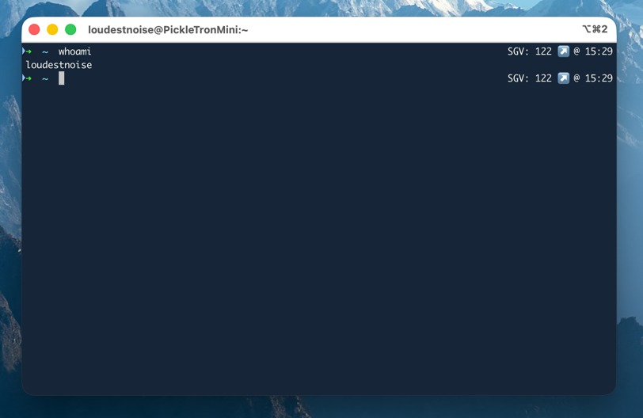

# Nightscout Terminal



## Goal 
Display blood glucose in terminal (specifically iterm2) without impeding performance.

#### Background
You can set up iterm to display custom commands in your status bar, so in effect you can have it curl your nightscout endpoint for your current bg. 
But this round trip on every call slows downs your terminal expierence.
SO the idea here is to have a cron job, or in this case, systemd job that runs every minute, and writes your current glucose to a file.
Now, all you need to do is cat that file, which is waaaaay faster than a curl.

## Prereqs
Nightscout Website

## How To Install

There are two supported ways to run the background job that refreshes
`~/glucose.txt`, depending on OS: `launchd` on macOS (via `deploy.sh`), or a
plain crontab entry on Linux (no deploy script for this path yet — it's a
few manual steps below).

### macOS (launchd)
Open up a shell and export two variables. `base_url` is the **full curl
target** — not just the domain — so include the entries path and, if your
Nightscout instance requires auth, the `?token=...` query param:
```bash
export base_url='https://<your-url>/api/v1/entries/current?token=<your-token>'
export script_dest='<your-path>/nightscoutcron.sh'
```
Run the deploy script:
```bash
sh ./deploy.sh
```
This generates `nightscoutcron.sh` and `com.dddiaz.nightscoutcron.plist` from
their `.template` counterparts (substituting `base_url` and `script_dest`),
copies the plist into `~/Library/LaunchAgents`, and loads it with
`launchctl` — it fires immediately (`RunAtLoad`) and then every 300s.

`deploy.sh` now aborts with an error if `base_url` or `script_dest` aren't
exported, rather than silently baking an empty string into the generated
script (which produces a host-less `curl` call that fails silently forever —
this bit us once already).

Verify it's working:
```bash
cat ~/glucose.txt
```

To pick up a change to `nightscoutcron.sh.template` (e.g. after a `git
pull`), just re-export the same two variables and re-run `sh ./deploy.sh` —
it regenerates the script and reloads the launchd job.

### Linux (cron)
No `deploy.sh` equivalent here yet — `launchd`-specific bits (the plist,
`launchctl load`) don't apply, so it's a few manual steps instead of one
script:

1. Generate the script from the template, substituting the **full curl
   target** (path + token, not just the domain) for `base_url_replace`:
   ```bash
   sed "s+base_url_replace+https://<your-url>/api/v1/entries/current?token=<your-token>+g" nightscoutcron.sh.template > nightscoutcron.sh
   chmod +x nightscoutcron.sh
   ```
2. Add a crontab entry to run it every minute:
   ```bash
   crontab -e
   ```
   ```cron
   */1 * * * * sh /path/to/nightscout-cronjob/nightscoutcron.sh
   ```
3. Verify it's working:
   ```bash
   cat ~/glucose.txt
   ```

`nightscoutcron.sh` (and the macOS `.plist`) are gitignored since `sh ./deploy.sh` /
the `sed` step above bake your real Nightscout URL and a local path into
them — regenerate from the `.template` file on each machine rather than
committing the generated file.

### Set up your shell to display the Blood Glucose info
Add the following line to your `.zshrc` file (same on macOS and Linux), then
reload it:
```bash
RPROMPT='$( echo "BG: " )$( cat ~/glucose.txt ) [%D{%m/%f/%y}|%@]'
```
Basically, all we are doing is catting the glucose file, which gives us access to the most recent data, without having to do a curl call!

#### Obviously shout out to the people at NightScout for making all this possible...
We are not waiting

#### Note this project is not officially endorsed by Nightscout in any way.

# Useful Links
https://alvinalexander.com/mac-os-x/mac-osx-startup-crontab-launchd-jobs